# Procesverslag
Markdown is een simpele manier om HTML te schrijven.
Markdown cheat cheet: [Hulp bij het schrijven van Markdown](https://github.com/adam-p/markdown-here/wiki/Markdown-Cheatsheet).

Nb. De standaardstructuur en de spartaanse opmaak van de README.md zijn helemaal prima. Het gaat om de inhoud van je procesverslag. Besteedt de tijd voor pracht en praal aan je website.

Nb. Door *open* toe te voegen aan een *details* element kun je deze standaard open zetten. Fijn om dat steeds voor de relevante stuk(ken) te doen.

## Jij

  
uitwerken voor kick-off werkgroep

  ### Auteur:
  Ian Hoogenboom

  #### Je startniveau:
  Blauw/Rood

  #### Je focus:
  Surface plane

## Je website

  
uitwerken voor kick-off werkgroep

  ### Je opdracht:
  Pagina 1:
  https://juicebro.com

  Pagina 2:
  https://juicebro.com/product/bietensap/

  #### Screenshot(s) van de eerste pagina (small screen):
  Home page JuiceBrothers
  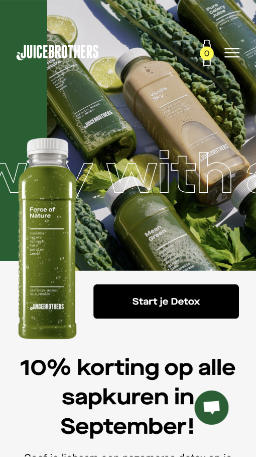

  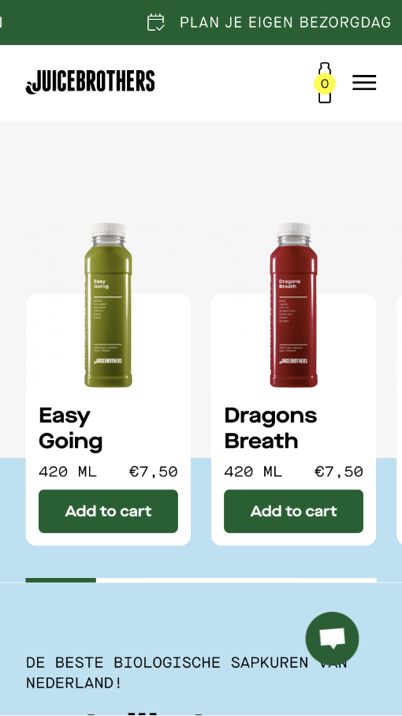

  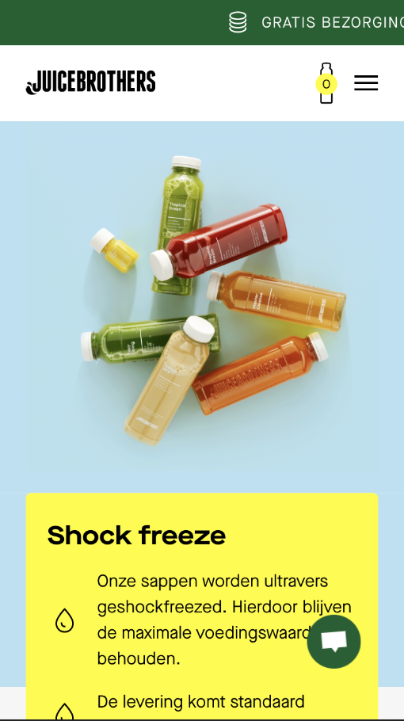

  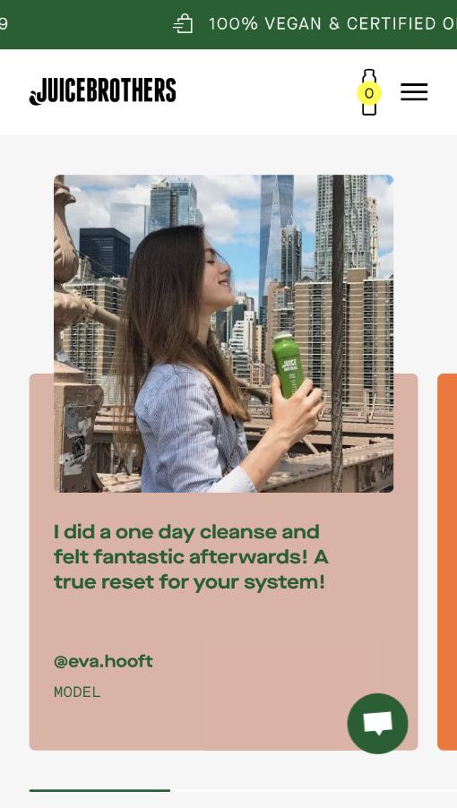

  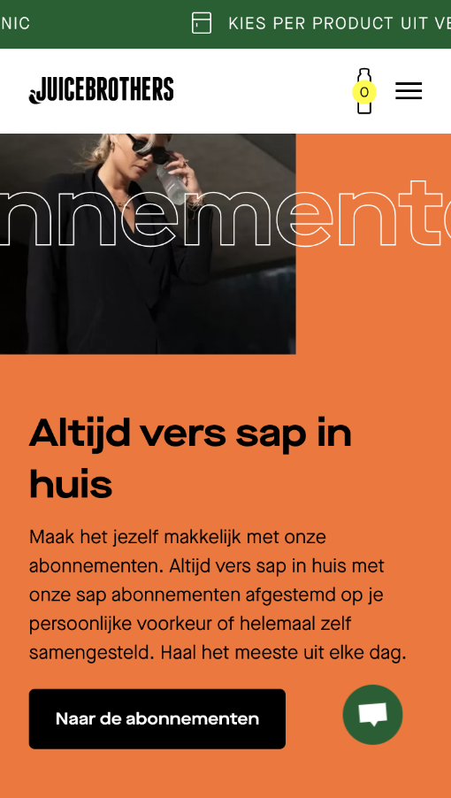

  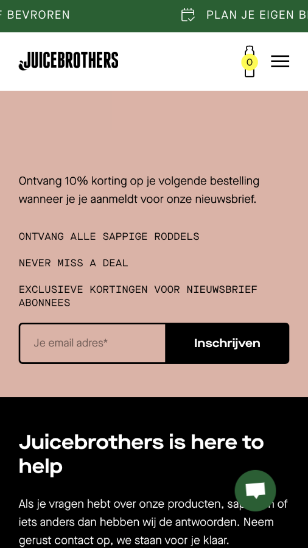

  #### Screenshot(s) van de tweede pagina (small screen):
  Product pagina
  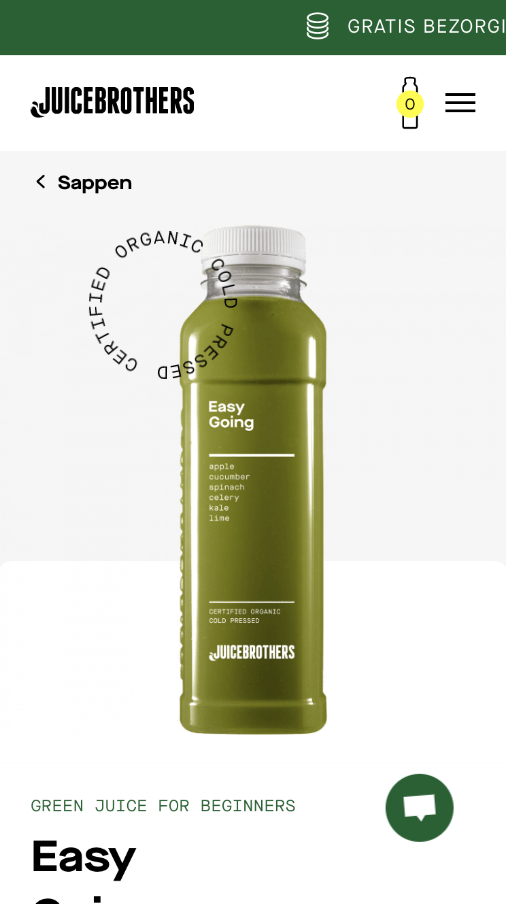

  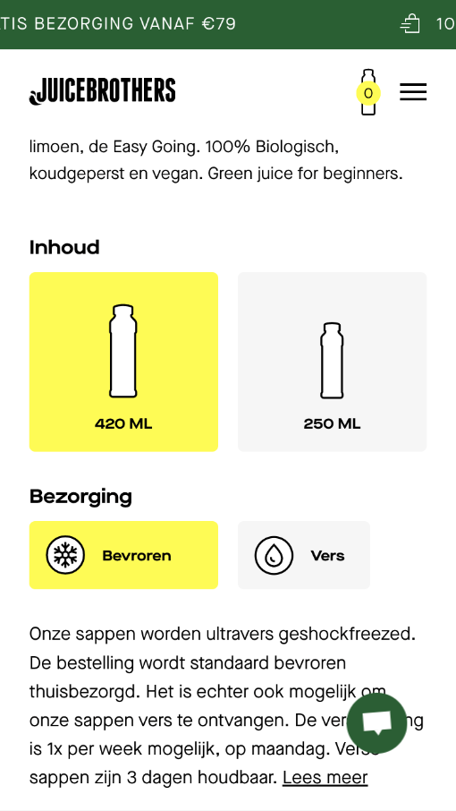

  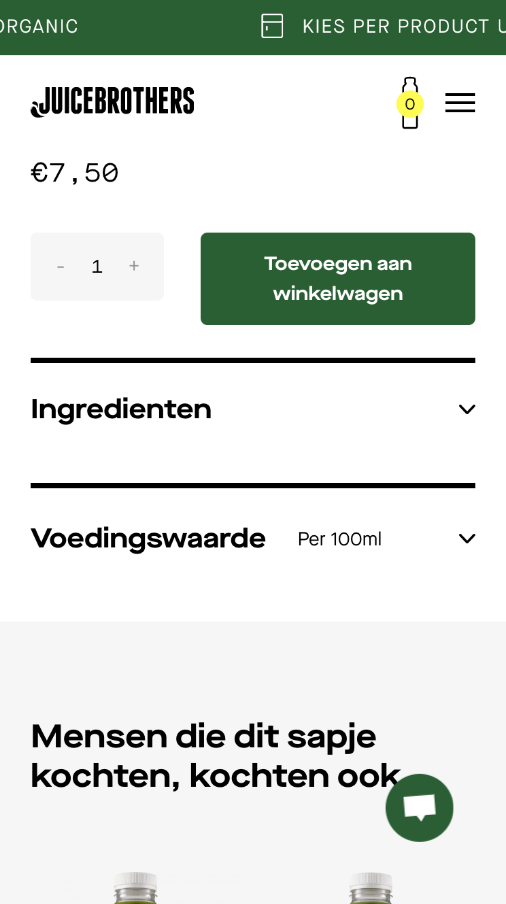

## Toegankelijkheidstest 1/2 (week 1)

  
uitwerken na test in 1e werkgroep

  ### Bevindingen
  Lijst met je bevindingen die in de test naar voren kwamen:
  - Website in het algemeen is goed toegankelijk.
  - Een aantal dingen kunnen beter, bijvoorbeeld: icoontjes voor bepaalde feed forward.

  #### Screenreader
  In het menu item 'shop' krijg je met een screenreader geen hover effect, wat je normaal gesproken wel krijgt.

  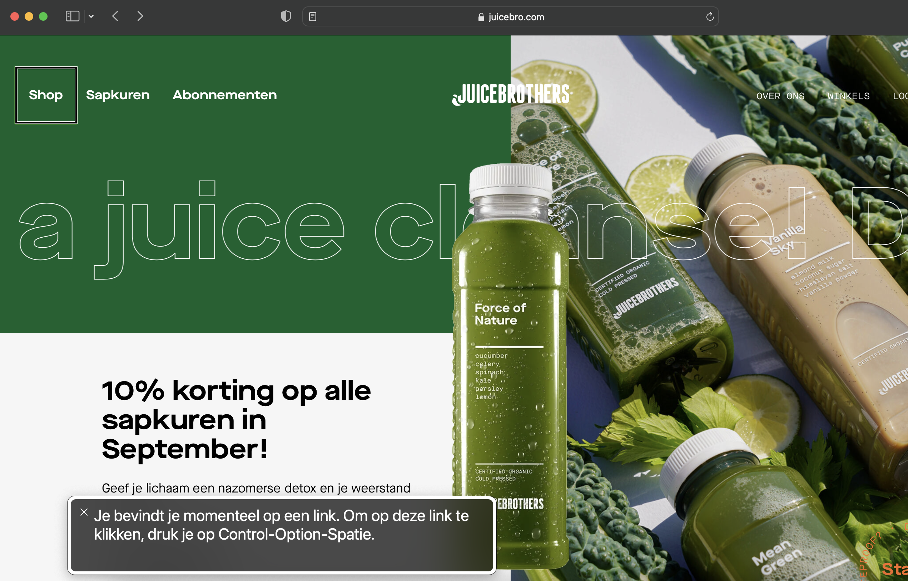

  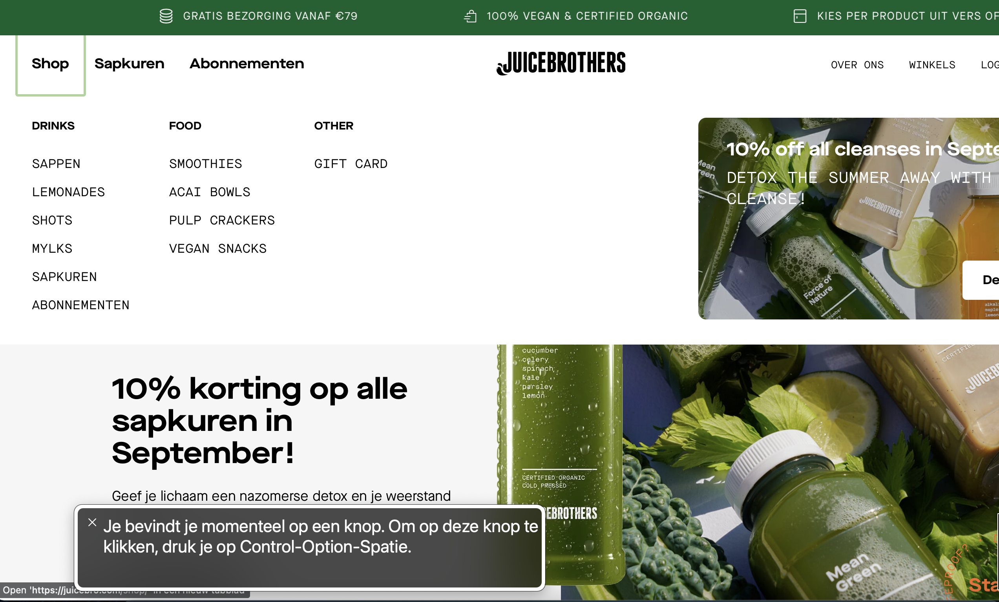

  dit kan opgelost worden door het menu al te laten uitklappen als je er 1 keer op klikt, en na de 2e keer pas naar de pagina gaat.

  #### Muis en Toetsenbord
  Op bepaalde delen van de website kan je naar rechts scrollen, dit wordt alleen niet heel goed aangegeven.

  Dit kan beter door bijvoorbeeld arrow icons toe te voegen bij de groene bar onderaan.
  

  #### Motoriek (shocks, elastiekjes)
  Met shocks en elastiekjes is het natuurlijk moeilijker te bedienen, maar ik kwam erachter dat de website nog makkelijk te bedienen was aangezien het duidelijk is waar de content staat. Binnen deze content zijn de buttons ook erg duidelijk.

  Hier een omschrijving van hoe het opgelost kan worden (met indien nodig afbeeldingen)

  #### Visueel (brillen, contrast, kleurenblind, dark/light).
  Kleuren combinaties zijn met de brillen nog goed genoeg te onderscheiden.
  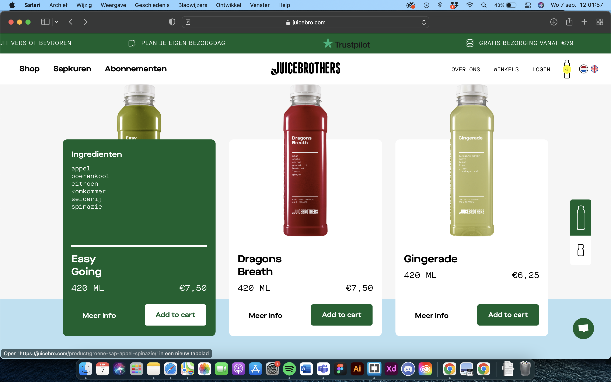

Knoppen zijn in het algemeen goed te onderscheiden, ook qua grootte.

  Je kan voor bepaalde knoppen meer ruimte gebruiken, maar de belangrijke knoppen zijn gebruiksvriendelijk.

## Breakdownschets (week 1)

  
uitwerken na afloop 2e werkgroep

  ### de hele pagina:
  

  ### dynamisch deel (bijv menu):
  

  ### wellicht nog een dynamisch deel (bijv filter):

## Voortgang 1 (week 2)

  
uitwerken voor 1e voortgang

  ### Stand van zaken
  Html structuur gaat goed, css ben ik nog niet ver mee.

  ### Agenda voor meeting
  samen met je groepje opstellen

  | Eva                              | Ian                        | Nikolai                    | Pepijn           | Sam         |
  | ---                              | ---                        | ---                        | ---              | ---         |
  |                                  | -hoe selecteer ik alleen de|                            |                  |             |
  |                                  | 2e p in een section,       |                            |                  |             |
  |                                  | als ik al section:first of |                            |                  |             |
  |                                  | type gebruik, hoe kan dit  |                            |                  |             |
  |                                  | beter.                     |                            |                  |             |
  |                                  | over de html structuur     |                            |                  |             |
  | ...                              | van mijn menu.             |                            | ...              | ...         |
  |                                  | - Ik heb nog wat moeite met|                            |                  |             |
  |                                  | het benoemen van de H's    |                            |                  |             |

  ### Verslag van meeting
  hier na afloop snel de uitkomsten van de meeting vastleggen

  * Feedback en opmerkingen

    - Header buiten main
    - Vergeet de ul niet voor de li
    - Geen a’s in p’s
    - H1 tot ongeveer h4 (tot h8 kan/hoeft niet)

## Voortgang 2 (week 3)

  
uitwerken voor 2e voortgang

  ### Stand van zaken
  Ik ben een stuk verder dan vorige week en krijg er wat meer handigheid in.
  Het is blijven proberen en anders vragen.

  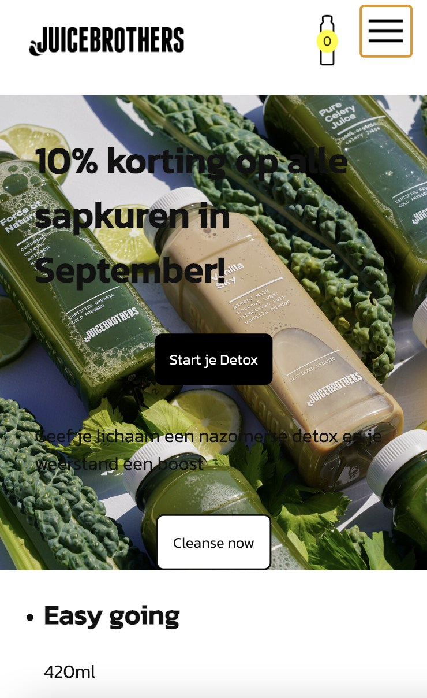
  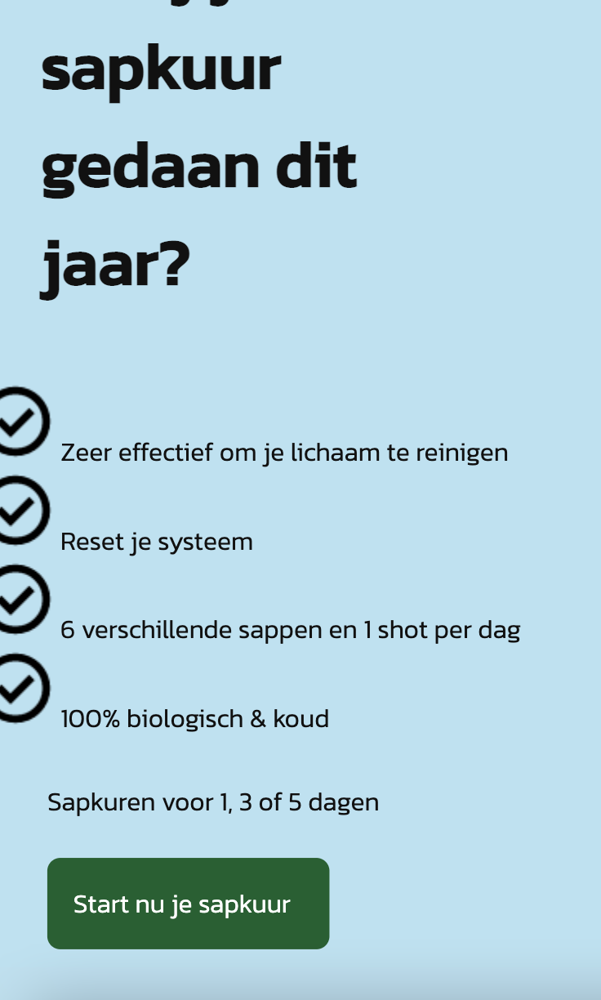
  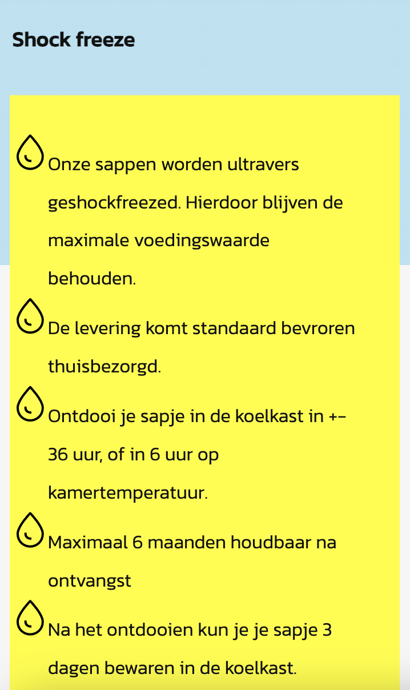
  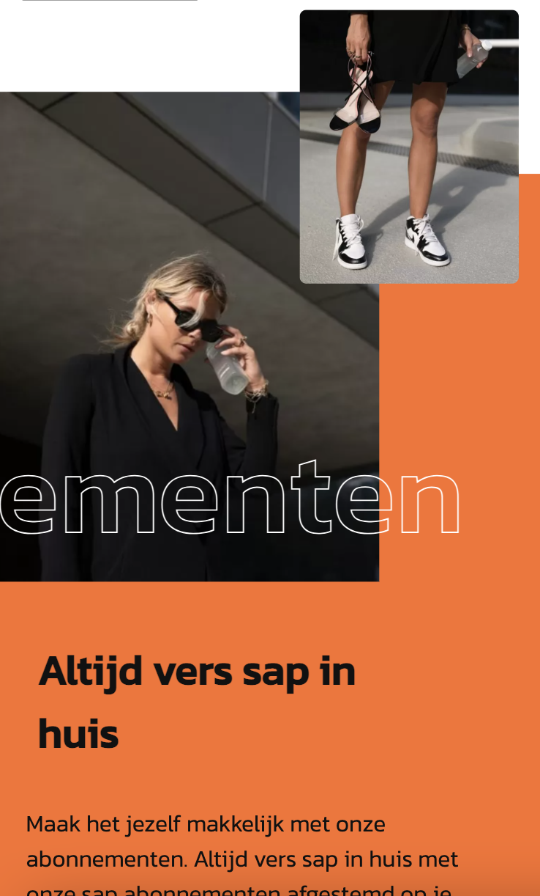

  ### Agenda voor meeting
  samen met je groepje opstellen

  | Eva                              | Ian                        | Nikolai                    | Pepijn           | Sam         |
  | ---                              | ---                        | ---                        | ---              | ---         |
  |                                  | Ik heb een vraag           | Aan welk aspect            |                  |             |
  |                                  | over de html structuur     | van toegankelijkheid       |                  |             |
  | ...                              | van mijn menu.             | kan ik werken.             | ...              | ...         |
  |                                  |                            | Welke dingen je kan doen   |                  |             |
  |                                  |                            | voor de surface plane.     |                  |             |

  ### Verslag van meeting
  hier na afloop snel de uitkomsten van de meeting vastleggen

  - readme bestand bijhouden.
  - het linken van images & mappen op de juiste manier.
  - voor de vormgeving mag ik soms een div gebruiken.
  - display: inline-block voor a'tjes.
  - menu hoeft niet volledig uitgewerkt te zijn.

## Toegankelijkheidstest 2/2 (week 4)

  
uitwerken na test in 8e werkgroep

  ### Bevindingen
  Lijst met je bevindingen die in de test naar voren kwamen (geef ook aan wat er verbeterd is):

  #### Screenreader
  Hier korte omschrijving (met indien nodig afbeeldingen)

  Hier een omschrijving van hoe het opgelost kan worden (met indien nodig afbeeldingen)

  #### Muis en Toetsenbord
  Hier korte omschrijving (met indien nodig afbeeldingen)

  Hier een omschrijving van hoe het opgelost kan worden (met indien nodig afbeeldingen)

  #### Motoriek (shocks, elastiekjes)
  Hier korte omschrijving (met indien nodig afbeeldingen)

  Hier een omschrijving van hoe het opgelost kan worden (met indien nodig afbeeldingen)

  #### Visueel (brillen, contrast, kleurenblind, dark/light).
  Hier korte omschrijving (met indien nodig afbeeldingen)

  Hier een omschrijving van hoe het opgelost kan worden (met indien nodig afbeeldingen)

## Voortgang 3 (week 4)

  
uitwerken voor 3e voortgang

  ### Stand van zaken
  hier dit ging goed & dit was lastig (neem ook screenshots op van delen van je website en code)

  ### Agenda voor meeting
  samen met je groepje opstellen

  | student 1      | student 2          | student 3    | student 4        |
  | ---            | ---                | ---          | ---              |
  | dit bespreken  | en dit             | en ik dit    | en dan ik dat    |
  | en dat ook nog | dit als er tijd is | nog een punt | dit wil ik zeker |
  | ...            | ...                | ...          | ...              |

  ### Verslag van meeting
  hier na afloop snel de uitkomsten van de meeting vastleggen

  - punt 1
  - punt 2
  - nog een punt
  - ...

## Eindgesprek (week 5)

  
uitwerken voor eindgesprek

  ### Je uitkomst - karakteristiek screenshots:
  

  ### Dit ging goed/Heb ik geleerd:
  Korte omschrijving met plaatjes

  

  ### Dit was lastig/Is niet gelukt:
  Korte omschrijving met plaatjes

  

## Bronnenlijst

  
continu bijhouden terwijl je werkt

  Nb. Wees specifiek ('css-tricks' als bron is bijv. niet specifiek genoeg).

  1. Alle images op mijn website zijn afkomstig van: https://juicebro.com/.
  2. Het hamburger menu: https://codepen.io/shooft/pen/vYjgNwj + https://codepen.io/shooft/pen/dymRMBZ.
  3. Symbool hamburger menu: https://fonts.google.com/icons.
  4. Check circle icoon: https://fonts.google.com/icons.
  5. Styling list bron :https://www.w3schools.com/css/css_list.asp.
  6. Text onzichtbaar maken.
  7. achtergrondkleur tot een bepaalde hoogte: https://medium.com/@codefoxx/html-css-how-to-split-a-background-into-2-colors-1cdc394deb3d.
  8. Tekst met alleen uitlijning: https://developer.mozilla.org/en-US/docs/Web/CSS/-webkit-text-stroke.
  9. Tekst die beweegt: https://forum.freecodecamp.org/t/marquee-html-loop-behavior/306036/4.
  10. De html en styling van het form https://www.w3schools.com/howto/howto_css_register_form.asp.

